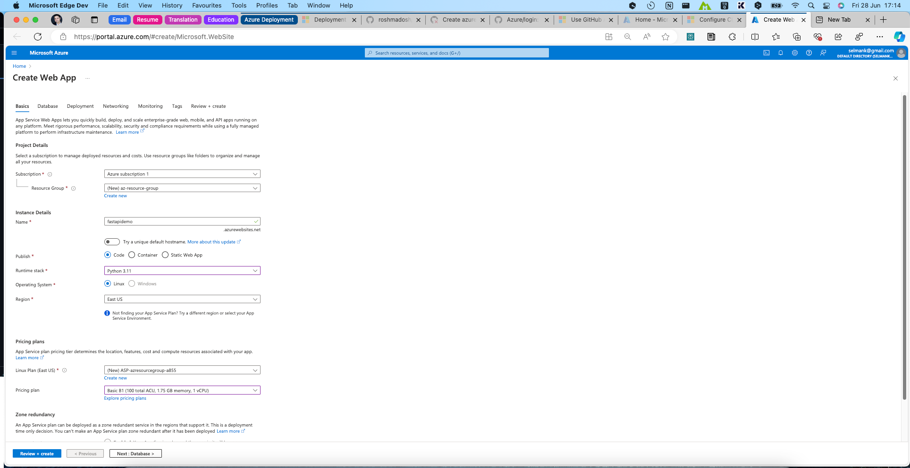
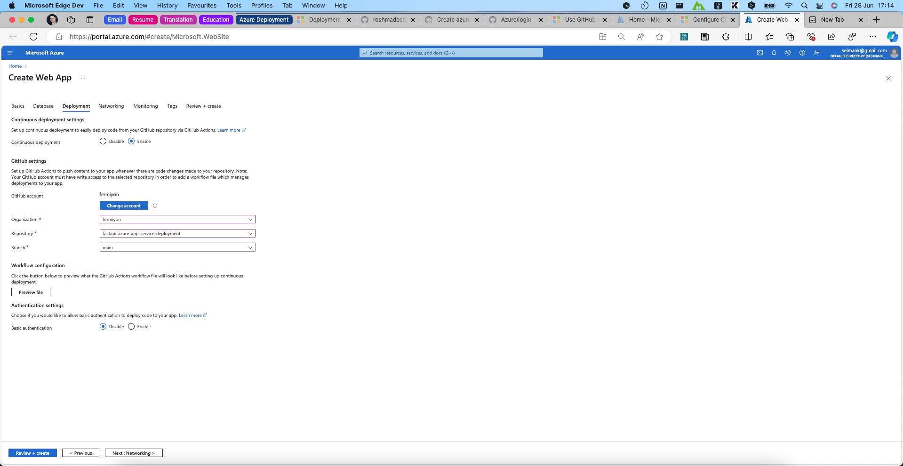
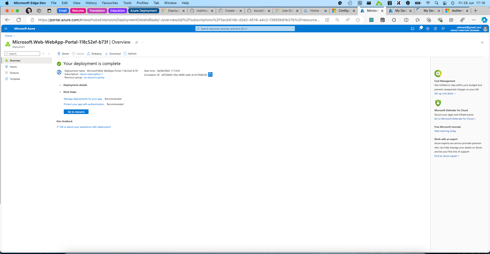
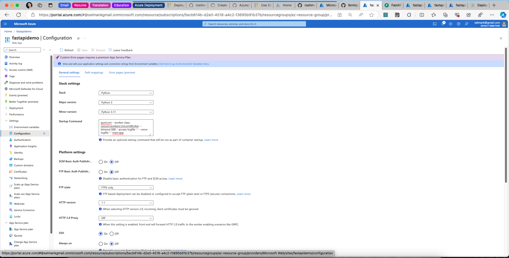

# fastapi-azure-app-service-deployment

Demo of FastAPI + GitHub Actions Continuous Deployment + Azure App Service.

## Azure Web app

### Go to Azure Portal - Create Web App

`https://portal.azure.com/#create/Microsoft.WebSite`



### Configure deployment options



### Complete



### Configure startup command

```bash
gunicorn --worker-class uvicorn.workers.UvicornWorker --timeout 600 --access-logfile '-' --error-logfile '-' main:app
```



## References

https://azureossd.github.io/2024/04/23/Deploying-a-Python-FastAPI-app-to-App-Service-Linux/

https://github.com/noahgift/fastapi